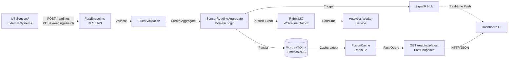
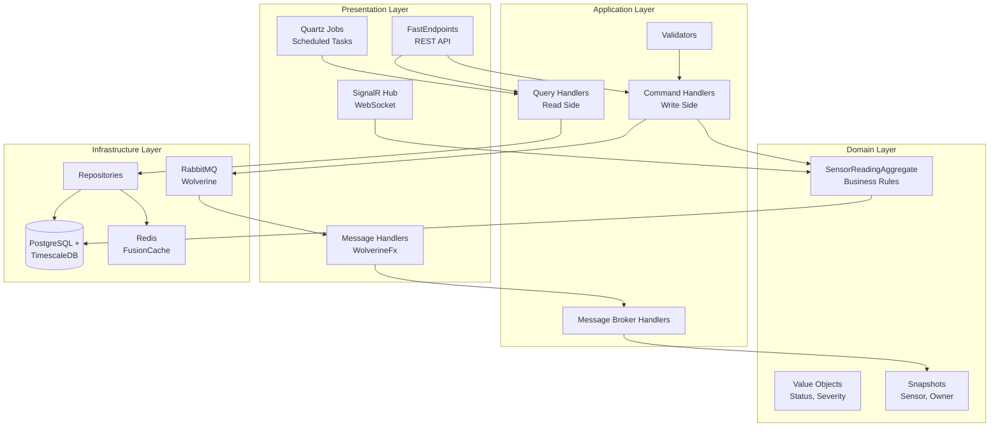

# TC.Agro Sensor Ingest Service 🌾

[](https://dotnet.microsoft.com/)
[](https://docs.microsoft.com/en-us/dotnet/csharp/)
[](https://github.com/rdpresser/tc-agro-sensor-ingest-service)
[](https://github.com/rdpresser/tc-agro-sensor-ingest-service)
[](https://github.com/rdpresser/tc-agro-sensor-ingest-service)
[](LICENSE)

> **High-Throughput Ingestion Microservice** for agricultural IoT sensor data with real-time validation, time-series persistence, and event-driven integration.

---

## 📋 Table of Contents

- [Overview](#-overview)
- [Architecture](#-architecture)
- [Technologies](#-technologies)
- [Prerequisites](#-prerequisites)
- [Quick Start](#-quick-start)
- [Configuration](#-configuration)
- [Running](#-running)
- [Testing](#-testing)
- [Project Structure](#-project-structure)
- [Domain-Driven Design](#-domain-driven-design)
- [API Endpoints](#-api-endpoints)
- [Real-Time Updates (SignalR)](#-real-time-updates-signalr)
- [Messaging](#-messaging)
- [TimescaleDB Features](#-timescaledb-features)
- [Metrics & Observability](#-metrics--observability)
- [License](#-license)

---

## 🎯 Overview

**TC.Agro Sensor Ingest Service** is a specialized microservice for ingesting and processing agricultural IoT sensor data in real-time. It:

- ✅ **Receives sensor readings** via REST API (single and batch operations)
- ✅ **Validates data** using FluentValidation with comprehensive business rules
- ✅ **Persists time-series data** to PostgreSQL with TimescaleDB hypertables
- ✅ **Caches latest readings** using FusionCache (L1 + L2 Redis) for fast queries
- ✅ **Publishes integration events** to RabbitMQ for downstream analytics processing
- ✅ **Pushes real-time updates** via SignalR WebSocket to connected dashboards
- ✅ **Maintains snapshots** of sensors and owners for query optimization
- ✅ **Provides historical queries** with efficient time-series aggregations
- ✅ **Ensures data consistency** with Wolverine Outbox Pattern

### Processing Flow



---

## 🏗️ Architecture

This project implements **Hexagonal Architecture** (Ports & Adapters) with **Domain-Driven Design** (DDD) and **CQRS**:



### Architectural Patterns

- ✅ **Hexagonal Architecture** - Core domain isolated from infrastructure
- ✅ **Domain-Driven Design (DDD)** - Rich domain modeling with Aggregates and Value Objects
- ✅ **CQRS** - Separation of commands (write) and queries (read)
- ✅ **Event-Driven Architecture** - Asynchronous communication via RabbitMQ
- ✅ **Outbox Pattern** - Transactional consistency of messages (Wolverine)
- ✅ **Repository Pattern** - Persistence abstraction
- ✅ **Result Pattern** - Error handling without exceptions (Ardalis.Result)
- ✅ **Snapshot Pattern** - Denormalized data cache for query optimization
- ✅ **Caching Pattern** - Multi-level caching (L1 in-memory + L2 Redis)

---

## 🛠️ Technologies

### Core

- **.NET 10.0** - Modern, high-performance framework
- **C# 14.0** - Programming language with advanced features

### API & Web

- **FastEndpoints 7.2** - Minimalist, high-performance API framework
- **SignalR** - Real-time bidirectional communication (WebSocket)
- **Swagger/OpenAPI** - Automatic API documentation

### Persistence

- **Entity Framework Core 10.0** - Modern ORM for .NET
- **PostgreSQL 16+** - Relational database
- **TimescaleDB 2.15+** - Time-series database extension
- **Npgsql 10.0** - High-performance PostgreSQL driver

### Caching

- **FusionCache 2.0** - High-performance multi-level caching
- **Redis 7.4+** - Distributed cache (L2)

### Message Broker

- **WolverineFx 5.15** - Messaging framework with integrated Outbox Pattern
- **RabbitMQ 4.0** - Enterprise-grade message broker

### Scheduling

- **Quartz.NET 4.0** - Job scheduling and execution

### Observability

- **Serilog 4.1** - Structured logging
- **OpenTelemetry** - Distributed tracing and metrics
- **Azure Monitor / Application Insights** - APM (Application Performance Monitoring)

### Testing

- **xUnit v3 (3.2.2)** - Unit testing framework
- **FakeItEasy 9.0** - Mocking framework
- **Shouldly 5.0** - Assertion library
- **FastEndpoints.Testing 7.2** - Helpers for endpoint testing

### Tools

- **Ardalis.Result 10.1** - Result Pattern for error handling
- **FluentValidation 12.1** - Data validations
- **AspNetCore.HealthChecks.NpgSql 9.0** - PostgreSQL health checks
- **AspNetCore.HealthChecks.Redis 9.0** - Redis health checks

---

## 📦 Prerequisites

### Required Software

```bash
# .NET SDK 10.0 or higher
dotnet --version
# Expected output: 10.0.x

# Docker (to run dependencies locally)
docker --version
# Expected output: 24.0.x or higher

# Docker Compose (optional for local development)
docker-compose --version
# Expected output: 2.x or higher
```

### External Dependencies

#### Production (Cloud)
- **PostgreSQL 16+** with **TimescaleDB 2.15+** - Managed database (Azure Database, AWS RDS, or other provider)
- **Redis 7.4+** - Managed cache (Azure Redis Cache, AWS ElastiCache, or other provider)
- **RabbitMQ 4.0+** - Managed message broker (CloudAMQP, Azure Service Bus, or other provider)

#### Local Development
- **PostgreSQL 16+** with TimescaleDB (via Docker or local installation)
- **Redis 7.4+** (via Docker or local installation)
- **RabbitMQ 4.0+** (via Docker or local installation)

### Shared Packages

This project depends on shared packages from the `tc-agro-common` repository:
- `TC.Agro.Contracts` - Integration events and DTOs
- `TC.Agro.Messaging` - Messaging configurations
- `TC.Agro.SharedKernel` - Base classes (Aggregate, Repository, etc.)

---

## 🚀 Quick Start

### Option 1: Docker Compose (Recommended)

```bash
# Clone the repository
git clone https://github.com/rdpresser/tc-agro-sensor-ingest-service.git
cd tc-agro-sensor-ingest-service

# Start all dependencies
docker-compose up -d

# Wait for services to be ready (30 seconds)
timeout 30

# Run the application
dotnet run --project src/Adapters/Inbound/TC.Agro.SensorIngest.Service
```

**Verify it's working:**

```bash
# Health check
curl http://localhost:5003/health

# Swagger UI
open http://localhost:5003/swagger
```

**Estimated time:** 2-3 minutes

### Option 2: Manual Setup

```bash
# 1. Clone the repository
git clone https://github.com/rdpresser/tc-agro-sensor-ingest-service.git
cd tc-agro-sensor-ingest-service

# 2. Restore dependencies
dotnet restore

# 3. Start dependencies with Docker
docker-compose up -d postgres redis rabbitmq

# 4. Apply migrations
dotnet ef database update \
  --project src/Adapters/Outbound/TC.Agro.SensorIngest.Infrastructure \
  --startup-project src/Adapters/Inbound/TC.Agro.SensorIngest.Service

# 5. Run the application
dotnet run --project src/Adapters/Inbound/TC.Agro.SensorIngest.Service
```

---

## ⚙️ Configuration

### Configuration Structure

The project uses ASP.NET Core's hierarchical configuration pattern:

```
appsettings.json (base - empty by default)
├── appsettings.Development.json (local development)
├── appsettings.Production.json (production/cloud)
└── Environment Variables (Docker/Kubernetes - override)
```

### appsettings.Development.json (Example)

```json
{
  "ConnectionStrings": {
    "DefaultConnection": "Host=localhost;Port=5432;Database=agro_sensor_ingest;Username=postgres;Password=postgres",
    "Redis": "localhost:6379,abortConnect=false"
  },
  "JwtSettings": {
    "Secret": "your-secret-key-min-32-chars-long",
    "Issuer": "agro-identity-service",
    "Audience": "agro-services",
    "ExpirationMinutes": 60
  },
  "RabbitMQ": {
    "Host": "localhost",
    "Port": 5672,
    "Username": "guest",
    "Password": "guest"
  },
  "SensorReadingsJob": {
    "IntervalSeconds": 30,
    "Enabled": true
  },
  "WeatherProvider": {
    "Latitude": -23.55,
    "Longitude": -46.63,
    "Enabled": true
  },
  "CacheSettings": {
    "DefaultDurationSeconds": 60,
    "LatestReadingsDurationSeconds": 60
  }
}
```

### appsettings.Production.json (Cloud Example)

```json
{
  "ConnectionStrings": {
    "DefaultConnection": "Host=your-db-server.postgres.database.azure.com;Port=5432;Database=agro_sensor_ingest;Username=postgres;Password=${DB_PASSWORD};SSL Mode=Require",
    "Redis": "${REDIS_CONNECTION_STRING}"
  },
  "JwtSettings": {
    "Secret": "${JWT_SECRET}",
    "Issuer": "agro-identity-service",
    "Audience": "agro-services",
    "ExpirationMinutes": 60
  },
  "RabbitMQ": {
    "Host": "xxx.cloudamqp.com",
    "Port": 5672,
    "Username": "xxx",
    "Password": "${RABBITMQ_PASSWORD}",
    "VirtualHost": "xxx"
  },
  "SensorReadingsJob": {
    "IntervalSeconds": 60,
    "Enabled": true
  },
  "WeatherProvider": {
    "Latitude": -23.55,
    "Longitude": -46.63,
    "ApiKey": "${WEATHER_API_KEY}",
    "Enabled": true
  },
  "ApplicationInsights": {
    "ConnectionString": "${APPLICATIONINSIGHTS_CONNECTION_STRING}"
  }
}
```

### Environment Variables (Docker/Kubernetes)

```bash
# Database
export ConnectionStrings__DefaultConnection="Host=postgres;Port=5432;Database=agro_sensor_ingest;Username=postgres;Password=${DB_PASSWORD}"
export ConnectionStrings__Redis="${REDIS_CONNECTION_STRING}"

# JWT
export JwtSettings__Secret="${JWT_SECRET}"

# RabbitMQ
export RabbitMQ__Host=rabbitmq
export RabbitMQ__Password="${RABBITMQ_PASSWORD}"

# Jobs
export SensorReadingsJob__IntervalSeconds=60

# Weather Provider
export WeatherProvider__ApiKey="${WEATHER_API_KEY}"

# Observability
export ApplicationInsights__ConnectionString="${APPINSIGHTS_CONN_STRING}"
```

---

## 🏃 Running

### Local Development

```bash
# Run with hot reload (recommended)
dotnet watch run --project src/Adapters/Inbound/TC.Agro.SensorIngest.Service

# Or without hot reload
dotnet run --project src/Adapters/Inbound/TC.Agro.SensorIngest.Service
```

**Expected output:**
```
info: Microsoft.Hosting.Lifetime[14]
      Now listening on: http://localhost:5003
info: WolverineFx[0]
      Wolverine messaging service is starting
info: Wolverine.RabbitMQ[0]
      Connected to RabbitMQ at localhost:5672
info: Quartz.Core[0]
      Quartz Scheduler started
```

**Available endpoints:**
- API: `http://localhost:5003`
- Swagger UI: `http://localhost:5003/swagger`
- Health Check (Live): `http://localhost:5003/health/live`
- Health Check (Ready): `http://localhost:5003/health/ready`
- SignalR Hub: `ws://localhost:5003/dashboard/sensorshub`

### Production (Build & Publish)

```bash
# Optimized build
dotnet build -c Release

# Publish artifacts
dotnet publish -c Release -o ./publish

# Run
cd publish
dotnet TC.Agro.SensorIngest.Service.dll
```

### Docker

#### Build Image

```bash
docker build -t tc-agro-sensor-ingest:latest -f src/Adapters/Inbound/TC.Agro.SensorIngest.Service/Dockerfile .
```

#### Run Container

```bash
docker run -d \
  --name sensor-ingest-service \
  -p 5003:8080 \
  -e ConnectionStrings__DefaultConnection="Host=postgres;Port=5432;Database=agro_sensor_ingest;Username=postgres;Password=postgres" \
  -e ConnectionStrings__Redis="redis:6379" \
  -e RabbitMQ__Host=rabbitmq \
  -e RabbitMQ__Password=guest \
  --network tc-agro-network \
  tc-agro-sensor-ingest:latest
```

### Health Checks

```bash
# Check liveness (service is running)
curl http://localhost:5003/health/live

# Check readiness (service is ready to accept traffic)
curl http://localhost:5003/health/ready

# Expected response:
{
  "status": "Healthy",
  "timestamp": "2026-02-01T20:00:00Z",
  "service": "Sensor Ingest Service",
  "checks": {
    "postgresql": "Healthy",
    "redis": "Healthy",
    "memory": "Healthy"
  }
}
```

---

## 🧪 Testing

### Run All Tests

```bash
# Complete suite
dotnet test

# With details
dotnet test --verbosity normal

# Only tests from a specific layer
dotnet test --filter "FullyQualifiedName~Domain"
dotnet test --filter "FullyQualifiedName~Application"
dotnet test --filter "FullyQualifiedName~Service"
```

### Run with Code Coverage

```bash
# Collect coverage
dotnet test --collect:"XPlat Code Coverage"

# Generate HTML report (requires ReportGenerator)
dotnet tool install -g dotnet-reportgenerator-globaltool

reportgenerator \
  -reports:"**/coverage.cobertura.xml" \
  -targetdir:"coveragereport" \
  -reporttypes:Html

# Open report
start coveragereport/index.html  # Windows
open coveragereport/index.html   # Mac/Linux
```

### Test Structure

```
test/TC.Agro.SensorIngest.Tests/
├── Domain/
│   ├── Aggregates/
│   │   └── SensorReadingAggregateTests.cs      # Aggregate root tests
│   ├── ValueObjects/
│   │   ├── AlertStatusTests.cs
│   │   ├── AlertSeverityTests.cs
│   │   └── SensorStatusTests.cs
│   └── Snapshots/
│       ├── SensorSnapshotTests.cs
│       └── OwnerSnapshotTests.cs
├── Application/
│   ├── Handlers/
│   │   ├── CreateReadingCommandHandlerTests.cs
│   │   ├── CreateBatchReadingsCommandHandlerTests.cs
│   │   └── GetLatestReadingsQueryHandlerTests.cs
│   ├── Validators/
│   │   ├── CreateReadingCommandValidatorTests.cs
│   │   └── CreateBatchReadingsCommandValidatorTests.cs
│   └── Mappers/
│       └── CreateReadingMapperTests.cs
└── Service/
    ├── Endpoints/
    │   ├── CreateReadingEndpointTests.cs
    │   ├── CreateBatchReadingsEndpointTests.cs
    │   └── GetLatestReadingsEndpointTests.cs
    └── Jobs/
        └── SensorReadingsJobTests.cs
```

### Tests in Watch Mode

```bash
# Run tests automatically on file save
dotnet watch test --project test/TC.Agro.SensorIngest.Tests
```

### Test Coverage by Layer

Based on the latest test run:

| Layer | Coverage | Files |
|-------|----------|-------|
| **Domain** | 94% | Aggregates, Value Objects, Snapshots |
| **Application** | 81% | Command/Query Handlers, Validators |
| **Infrastructure** | 0.5% | Repositories, EF Core (integration tests) |
| **Service** | 18% | Endpoints, Jobs (integration/E2E tests) |

**Note:** Infrastructure and Service layers are typically covered by integration and E2E tests rather than unit tests.

---

## 📂 Project Structure

```
tc-agro-sensor-ingest-service/
├── src/
│   ├── Core/                                           # Domain + Application Logic
│   │   ├── TC.Agro.SensorIngest.Domain/
│   │   │   ├── Aggregates/
│   │   │   │   ├── SensorReadingAggregate.cs           # 🎯 Aggregate Root with validation rules
│   │   │   │   └── SensorReadingDomainErrors.cs        # Domain errors
│   │   │   ├── ValueObjects/
│   │   │   │   ├── AlertStatus.cs                      # Pending, Acknowledged, Resolved
│   │   │   │   ├── AlertSeverity.cs                    # Low, Medium, High, Critical
│   │   │   │   └── SensorStatus.cs                     # Active, Inactive, Maintenance
│   │   │   ├── Snapshots/
│   │   │   │   ├── SensorSnapshot.cs                   # Denormalized sensor cache
│   │   │   │   └── OwnerSnapshot.cs                    # Denormalized owner cache
│   │   │   └── Abstractions/
│   │   │       └── DomainError.cs                      # Base error class
│   │   │
│   │   └── TC.Agro.SensorIngest.Application/
│   │       ├── MessageBrokerHandlers/                  # 📨 WolverineFx Handlers
│   │       │   ├── SensorSnapshotHandler.cs            # Maintains sensor snapshots
│   │       │   └── OwnerSnapshotHandler.cs             # Maintains owner snapshots
│   │       ├── UseCases/                               # 🎯 CQRS Handlers
│   │       │   ├── CreateReading/
│   │       │   │   ├── CreateReadingCommand.cs
│   │       │   │   ├── CreateReadingCommandHandler.cs
│   │       │   │   ├── CreateReadingCommandValidator.cs
│   │       │   │   ├── CreateReadingMapper.cs
│   │       │   │   └── CreateReadingResponse.cs
│   │       │   ├── CreateBatchReadings/
│   │       │   │   ├── CreateBatchReadingsCommand.cs
│   │       │   │   ├── CreateBatchReadingsCommandHandler.cs
│   │       │   │   ├── CreateBatchReadingsCommandValidator.cs
│   │       │   │   └── CreateBatchReadingsResponse.cs
│   │       │   ├── GetLatestReadings/
│   │       │   │   ├── GetLatestReadingsQuery.cs
│   │       │   │   ├── GetLatestReadingsQueryHandler.cs
│   │       │   │   └── GetLatestReadingsResponse.cs
│   │       │   ├── GetSensorReadings/
│   │       │   │   ├── GetSensorReadingsQuery.cs
│   │       │   │   ├── GetSensorReadingsQueryHandler.cs
│   │       │   │   └── GetSensorReadingsResponse.cs
│   │       │   └── GetDashboardData/
│   │       │       ├── GetDashboardDataQuery.cs
│   │       │       ├── GetDashboardDataQueryHandler.cs
│   │       │       └── GetDashboardDataResponse.cs
│   │       ├── Abstractions/Ports/
│   │       │   ├── ISensorReadingRepository.cs         # Write repository interface
│   │       │   ├── ISensorReadingReadStore.cs          # Read store interface
│   │       │   └── ISensorHubNotifier.cs               # SignalR notifier interface
│   │       ├── Abstractions/Mappers/
│   │       │   └── IMapper.cs
│   │       └── DependencyInjection.cs
│   │
│   └── Adapters/                                       # Infrastructure & Presentation
│       ├── Inbound/                                    # 🌐 Presentation Layer
│       │   └── TC.Agro.SensorIngest.Service/
│       │       ├── Program.cs                          # Bootstrap + DI Container
│       │       ├── Endpoints/Readings/                 # 🚀 FastEndpoints
│       │       │   ├── CreateReadingEndpoint.cs
│       │       │   ├── CreateBatchReadingsEndpoint.cs
│       │       │   ├── GetLatestReadingsEndpoint.cs
│       │       │   ├── GetSensorReadingsEndpoint.cs
│       │       │   └── GetDashboardDataEndpoint.cs
│       │       ├── Hubs/
│       │       │   └── SensorsHub.cs                   # 📡 SignalR Hub
│       │       ├── Jobs/
│       │       │   └── SensorReadingsJob.cs            # ⏰ Quartz scheduled job
│       │       ├── Providers/
│       │       │   └── WeatherDataProvider.cs          # External weather API integration
│       │       ├── Services/
│       │       │   └── SensorHubNotifier.cs            # SignalR notification service
│       │       ├── Middleware/
│       │       │   └── TelemetryMiddleware.cs          # OpenTelemetry middleware
│       │       ├── Extensions/
│       │       │   └── ServiceCollectionExtensions.cs  # DI extensions
│       │       ├── appsettings.json
│       │       ├── appsettings.Development.json
│       │       └── appsettings.Production.json
│       │
│       └── Outbound/                                   # 🗄️ Infrastructure Layer
│           └── TC.Agro.SensorIngest.Infrastructure/
│               ├── Repositories/
│               │   ├── BaseRepository.cs               # Generic repository base
│               │   ├── SensorReadingRepository.cs      # Write repository (EF Core)
│               │   └── SensorReadingReadStore.cs       # Read store (Dapper + Cache)
│               ├── Persistence/
│               │   ├── ApplicationDbContext.cs         # EF Core DbContext
│               │   └── Configurations/                 # Entity configurations
│               │       ├── SensorReadingConfiguration.cs
│               │       ├── SensorSnapshotConfiguration.cs
│               │       └── OwnerSnapshotConfiguration.cs
│               ├── Migrations/                         # EF Core migrations
│               │   └── 20260201_InitialCreate.cs
│               └── DependencyInjection.cs
│
├── test/
│   └── TC.Agro.SensorIngest.Tests/
│       ├── Domain/                                     # Domain tests (pure)
│       ├── Application/                                # Application tests (with mocks)
│       ├── Service/                                    # Endpoint and job tests
│       ├── Builders/                                   # Test data builders
│       └── GlobalUsings.cs
│
├── docker-compose.yml                                  # Local stack (PostgreSQL + Redis + RabbitMQ)
├── Dockerfile                                          # Production container
├── Directory.Packages.props                            # Central Package Management (CPM)
├── .editorconfig                                       # Code style
├── .gitignore
├── README.md
└── LICENSE
```

### Layers and Responsibilities

| Layer | Responsibility | Dependencies |
|-------|----------------|--------------|
| **Domain** | Business rules, aggregates, value objects, validations | None (pure domain) |
| **Application** | Use cases, handlers, interfaces, DTOs | Domain |
| **Infrastructure** | Persistence, messaging, caching, integrations | Application, Domain |
| **Presentation** | REST API, SignalR Hub, endpoints, jobs | Application |

---

## 🎨 Domain-Driven Design

### SensorReadingAggregate (Aggregate Root)

The **SensorReadingAggregate** is the core domain entity responsible for sensor data validation and business rules.

```csharp
// Factory method - Creates sensor reading from incoming data
var result = SensorReadingAggregate.Create(
    sensorId: "sensor-001",
    plotId: plotGuid,
    time: DateTime.UtcNow,
    temperature: 28.5,
    humidity: 65.2,
    soilMoisture: 42.1,
    rainfall: 0.0,
    batteryLevel: 85.0
);

if (result.IsSuccess)
{
    var reading = result.Value;
    await repository.AddAsync(reading, cancellationToken);

    // Publish integration event for analytics
    await messageBus.PublishAsync(new SensorIngestedIntegrationEvent(
        sensorId: reading.SensorId,
        plotId: reading.PlotId,
        timestamp: reading.Time,
        temperature: reading.Temperature,
        humidity: reading.Humidity,
        soilMoisture: reading.SoilMoisture,
        rainfall: reading.Rainfall,
        batteryLevel: reading.BatteryLevel
    ));
}
```

### Business Rules

The aggregate enforces the following validation rules:

1. **SensorId** - Required, max 100 characters
2. **PlotId** - Required, valid GUID
3. **Timestamp** - Required, cannot be in the future
4. **Temperature** - Optional, range: -50°C to 70°C
5. **Humidity** - Optional, range: 0% to 100%
6. **SoilMoisture** - Optional, range: 0% to 100%
7. **Rainfall** - Optional, must be >= 0 mm
8. **BatteryLevel** - Optional, range: 0% to 100%
9. **At least one metric** - temperature, humidity, soilMoisture, or rainfall must be provided

### Value Objects

#### **AlertStatus** - Alert Lifecycle Status

```csharp
public static class AlertStatus
{
    public static readonly AlertStatus Pending = new("Pending");           // Newly detected, awaiting acknowledgment
    public static readonly AlertStatus Acknowledged = new("Acknowledged"); // Acknowledged, being handled
    public static readonly AlertStatus Resolved = new("Resolved");         // Resolved, no longer active
}
```

#### **AlertSeverity** - Alert Severity Levels

```csharp
public static class AlertSeverity
{
    public static readonly AlertSeverity Low = new("Low", level: 1);
    public static readonly AlertSeverity Medium = new("Medium", level: 2);
    public static readonly AlertSeverity High = new("High", level: 3);
    public static readonly AlertSeverity Critical = new("Critical", level: 4);
}
```

#### **SensorStatus** - Sensor Operational Status

```csharp
public static class SensorStatus
{
    public static readonly SensorStatus Active = new("Active");           // Sensor is operational
    public static readonly SensorStatus Inactive = new("Inactive");       // Sensor is offline/deactivated
    public static readonly SensorStatus Maintenance = new("Maintenance"); // Sensor is under maintenance
}
```

### Snapshots (Denormalization)

To optimize queries and reduce joins, we maintain snapshots (denormalized caches) of entities from other bounded contexts:

#### **SensorSnapshot** - Sensor Cache

```csharp
public class SensorSnapshot
{
    public Guid Id { get; set; }              // SensorId
    public string Label { get; set; }         // "Sensor-001"
    public Guid PlotId { get; set; }
    public string PlotName { get; set; }      // "Plot A"
    public string PropertyName { get; set; }  // "Farm XYZ"
    public Guid OwnerId { get; set; }
    public SensorStatus Status { get; set; }  // Active, Inactive, Maintenance
    public DateTimeOffset LastReadingAt { get; set; }
    public bool IsDeleted { get; set; }
}
```

#### **OwnerSnapshot** - Owner Cache

```csharp
public class OwnerSnapshot
{
    public Guid Id { get; set; }              // OwnerId (UserId)
    public string FullName { get; set; }      // "John Doe"
    public string Email { get; set; }
    public string? PhoneNumber { get; set; }
    public bool IsDeleted { get; set; }
}
```

These snapshots are automatically synchronized via event handlers (`SensorSnapshotHandler`, `OwnerSnapshotHandler`) consuming integration events from Farm Management and Identity services.

---

## 🚀 API Endpoints

### 1. Ingest Single Sensor Reading

**POST** `/readings`

Ingests a single sensor reading with validation and real-time processing.

**Authorization:** JWT Bearer Token (Roles: Admin, Producer, Sensor)

**Request Body:**
```json
{
  "sensorId": "sensor-001",
  "plotId": "a1b2c3d4-e5f6-7890-abcd-ef1234567890",
  "timestamp": "2026-01-28T10:30:00Z",
  "temperature": 28.5,
  "humidity": 65.2,
  "soilMoisture": 42.1,
  "rainfall": 0.0,
  "batteryLevel": 85.0
}
```

**Response 202 Accepted:**
```json
{
  "readingId": "uuid",
  "sensorId": "sensor-001",
  "plotId": "a1b2c3d4-e5f6-7890-abcd-ef1234567890",
  "timestamp": "2026-01-28T10:30:00Z",
  "message": "Reading received successfully"
}
```

**Actions Performed:**
- ✅ Validates input data
- ✅ Creates SensorReadingAggregate
- ✅ Persists to TimescaleDB hypertable
- ✅ Invalidates cache for latest readings
- ✅ Publishes `SensorIngestedIntegrationEvent` to RabbitMQ
- ✅ Pushes real-time update via SignalR

---

### 2. Ingest Batch Sensor Readings

**POST** `/readings/batch`

Ingests multiple sensor readings in a single request (max 1000 readings).

**Authorization:** JWT Bearer Token (Roles: Admin, Producer, Sensor)

**Request Body:**
```json
{
  "readings": [
    {
      "sensorId": "sensor-001",
      "plotId": "a1b2c3d4-e5f6-7890-abcd-ef1234567890",
      "timestamp": "2026-01-28T10:30:00Z",
      "temperature": 28.5,
      "humidity": 65.2,
      "soilMoisture": 42.1,
      "rainfall": 0.0,
      "batteryLevel": 85.0
    },
    {
      "sensorId": "sensor-002",
      "plotId": "b2c3d4e5-f6a7-8901-bcde-f12345678901",
      "timestamp": "2026-01-28T10:30:00Z",
      "temperature": 30.2,
      "humidity": 58.7,
      "soilMoisture": 38.9,
      "rainfall": 0.0,
      "batteryLevel": 92.0
    }
  ]
}
```

**Response 202 Accepted:**
```json
{
  "processedCount": 2,
  "failedCount": 0,
  "results": [
    {
      "sensorId": "sensor-001",
      "success": true,
      "readingId": "uuid-1"
    },
    {
      "sensorId": "sensor-002",
      "success": true,
      "readingId": "uuid-2"
    }
  ]
}
```

**Validation Rules:**
- Maximum 1000 readings per batch
- Each reading must pass individual validation
- Partial success supported (some readings can fail while others succeed)

---

### 3. Get Latest Sensor Readings

**GET** `/readings/latest?sensorId={sensorId}&limit={limit}`

Retrieves the latest sensor readings with caching (60s TTL).

**Authorization:** JWT Bearer Token (Roles: Admin, Producer)

**Query Parameters:**
- `sensorId` (optional) - Filter by specific sensor
- `limit` (optional, default: 10, max: 100) - Number of readings to return

**Response 200 OK:**
```json
{
  "readings": [
    {
      "id": "uuid",
      "sensorId": "sensor-001",
      "sensorLabel": "Sensor-001",
      "plotId": "a1b2c3d4-e5f6-7890-abcd-ef1234567890",
      "plotName": "Plot A",
      "propertyName": "Farm XYZ",
      "time": "2026-01-28T10:30:00Z",
      "temperature": 28.5,
      "humidity": 65.2,
      "soilMoisture": 42.1,
      "rainfall": 0.0,
      "batteryLevel": 85.0
    }
  ],
  "totalCount": 1,
  "cacheHit": true
}
```

**Caching Strategy:**
- **L1 Cache:** In-memory (per instance)
- **L2 Cache:** Redis (shared across instances)
- **TTL:** 60 seconds
- **Cache Key:** `latest-readings:{sensorId}:{limit}`

---

### 4. Get Historical Sensor Readings

**GET** `/sensors/{sensorId}/readings?from={from}&to={to}&limit={limit}`

Retrieves historical sensor readings with time-series aggregations.

**Authorization:** JWT Bearer Token (Roles: Admin, Producer)

**Path Parameters:**
- `sensorId` (required) - Sensor identifier

**Query Parameters:**
- `from` (optional, default: 7 days ago) - Start timestamp (ISO 8601)
- `to` (optional, default: now) - End timestamp (ISO 8601)
- `limit` (optional, default: 100, max: 1000) - Number of readings

**Response 200 OK:**
```json
{
  "sensorId": "sensor-001",
  "sensorLabel": "Sensor-001",
  "plotName": "Plot A",
  "readings": [
    {
      "time": "2026-01-28T10:30:00Z",
      "temperature": 28.5,
      "humidity": 65.2,
      "soilMoisture": 42.1,
      "rainfall": 0.0,
      "batteryLevel": 85.0
    }
  ],
  "totalCount": 1,
  "periodStart": "2026-01-21T10:30:00Z",
  "periodEnd": "2026-01-28T10:30:00Z"
}
```

---

### 5. Get Dashboard Data

**GET** `/dashboard/latest`

Retrieves aggregated data for dashboard display (cached).

**Authorization:** JWT Bearer Token (Roles: Admin, Producer)

**Response 200 OK:**
```json
{
  "totalSensors": 150,
  "activeSensors": 145,
  "inactiveSensors": 5,
  "totalReadingsToday": 10800,
  "avgTemperature": 26.8,
  "avgHumidity": 62.5,
  "avgSoilMoisture": 45.2,
  "totalRainfallToday": 12.5,
  "lowBatterySensors": 3,
  "lastUpdateAt": "2026-01-28T10:30:00Z"
}
```

---

## 📡 Real-Time Updates (SignalR)

### SignalR Hub

**Endpoint:** `ws://localhost:5003/dashboard/sensorshub`

**Authentication:** JWT Bearer Token (sent via query string or header)

### Client Connection (JavaScript)

```javascript
const connection = new signalR.HubConnectionBuilder()
    .withUrl("http://localhost:5003/dashboard/sensorshub", {
        accessTokenFactory: () => localStorage.getItem("jwtToken")
    })
    .withAutomaticReconnect()
    .build();

// Listen for new sensor readings
connection.on("ReceiveSensorReading", (reading) => {
    console.log("New reading:", reading);
    updateDashboard(reading);
});

// Listen for sensor status changes
connection.on("ReceiveSensorStatusUpdate", (update) => {
    console.log("Sensor status changed:", update);
    updateSensorStatus(update);
});

// Start connection
await connection.start();
console.log("SignalR Connected");
```

### Hub Methods

| Method | Description | Payload |
|--------|-------------|---------|
| `ReceiveSensorReading` | New sensor reading ingested | `{ sensorId, plotId, timestamp, temperature, humidity, soilMoisture, rainfall, batteryLevel }` |
| `ReceiveSensorStatusUpdate` | Sensor status changed | `{ sensorId, status, changedAt }` |
| `ReceiveDashboardUpdate` | Dashboard metrics updated | `{ totalSensors, activeSensors, avgTemperature, ... }` |

---

## 📨 Messaging

### Events Published

| Event | Trigger | Routing Key | Consumers |
|-------|---------|-------------|-----------|
| `SensorIngestedIntegrationEvent` | New reading ingested | `sensor.reading.ingested` | Analytics Worker |

**Event Example:**
```json
{
  "eventId": "uuid",
  "occurredOn": "2026-01-28T10:30:00Z",
  "eventName": "SensorIngestedIntegrationEvent",
  "aggregateId": "reading-uuid",
  "sensorId": "sensor-001",
  "plotId": "a1b2c3d4-e5f6-7890-abcd-ef1234567890",
  "timestamp": "2026-01-28T10:30:00Z",
  "temperature": 28.5,
  "humidity": 65.2,
  "soilMoisture": 42.1,
  "rainfall": 0.0,
  "batteryLevel": 85.0
}
```

### Events Consumed

| Event | Source | Action | Routing Key |
|-------|--------|--------|-------------|
| `UserCreatedIntegrationEvent` | Identity Service | Creates OwnerSnapshot | `user.created` |
| `UserUpdatedIntegrationEvent` | Identity Service | Updates OwnerSnapshot | `user.updated` |
| `UserDeactivatedIntegrationEvent` | Identity Service | Soft-deletes OwnerSnapshot | `user.deactivated` |
| `SensorRegisteredIntegrationEvent` | Farm Service | Creates SensorSnapshot | `sensor.registered` |
| `SensorOperationalStatusChangedIntegrationEvent` | Farm Service | Updates SensorSnapshot | `sensor.status.changed` |
| `SensorDeactivatedIntegrationEvent` | Farm Service | Soft-deletes SensorSnapshot | `sensor.deactivated` |

---

## ⏱️ TimescaleDB Features

### Hypertable Configuration

The `sensor_readings` table is configured as a TimescaleDB hypertable for efficient time-series storage:

```sql
-- Create hypertable (executed in migration)
SELECT create_hypertable('sensor_readings', 'time');

-- Indexes for common queries
CREATE INDEX ix_sensor_readings_sensor_id_time 
    ON sensor_readings (sensor_id, time DESC);

CREATE INDEX ix_sensor_readings_plot_id_time 
    ON sensor_readings (plot_id, time DESC);
```

### Time-Series Queries

#### Average metrics per hour (last 7 days)

```sql
SELECT
  time_bucket('1 hour', time) AS hour,
  AVG(temperature) AS avg_temperature,
  MAX(temperature) AS max_temperature,
  MIN(temperature) AS min_temperature,
  AVG(humidity) AS avg_humidity,
  AVG(soil_moisture) AS avg_soil_moisture,
  SUM(rainfall) AS total_rainfall
FROM sensor_readings
WHERE sensor_id = 'sensor-001'
  AND time > now() - interval '7 days'
GROUP BY hour
ORDER BY hour DESC;
```

#### Latest reading per sensor

```sql
SELECT DISTINCT ON (sensor_id)
  sensor_id,
  time,
  temperature,
  humidity,
  soil_moisture,
  rainfall,
  battery_level
FROM sensor_readings
ORDER BY sensor_id, time DESC;
```

### Data Retention Policy

Automatic data retention policy (configured via migration):

```sql
-- Keep raw data for 90 days
SELECT add_retention_policy('sensor_readings', INTERVAL '90 days');

-- Create continuous aggregate for hourly data (keep for 2 years)
CREATE MATERIALIZED VIEW sensor_readings_hourly
WITH (timescaledb.continuous) AS
SELECT
  time_bucket('1 hour', time) AS hour,
  sensor_id,
  AVG(temperature) AS avg_temperature,
  AVG(humidity) AS avg_humidity,
  AVG(soil_moisture) AS avg_soil_moisture,
  SUM(rainfall) AS total_rainfall
FROM sensor_readings
GROUP BY hour, sensor_id;

SELECT add_retention_policy('sensor_readings_hourly', INTERVAL '2 years');
```

---

## 📊 Metrics & Observability

### OpenTelemetry Metrics

The service exposes the following metrics:

| Metric | Type | Description |
|--------|------|-------------|
| `sensor_readings_ingested_total` | Counter | Total readings ingested |
| `sensor_readings_batch_size` | Histogram | Batch size distribution |
| `sensor_readings_validation_errors_total` | Counter | Validation errors |
| `sensor_readings_processing_duration_ms` | Histogram | Processing duration |
| `cache_hits_total` | Counter | Cache hits |
| `cache_misses_total` | Counter | Cache misses |

### Structured Logging

All logs include correlation IDs for distributed tracing:

```csharp
Log.Information(
    "Sensor reading ingested for {SensorId} at {Timestamp}",
    reading.SensorId,
    reading.Time);
```

### Health Checks

| Endpoint | Check | Status |
|----------|-------|--------|
| `/health/live` | Service is running | Liveness probe |
| `/health/ready` | Dependencies are ready (PostgreSQL, Redis) | Readiness probe |

---

## 📄 License

This project is licensed under the MIT License - see the [LICENSE](LICENSE) file for details.
