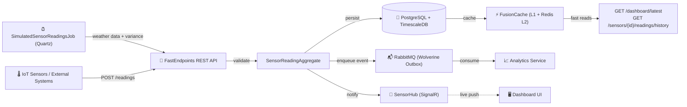
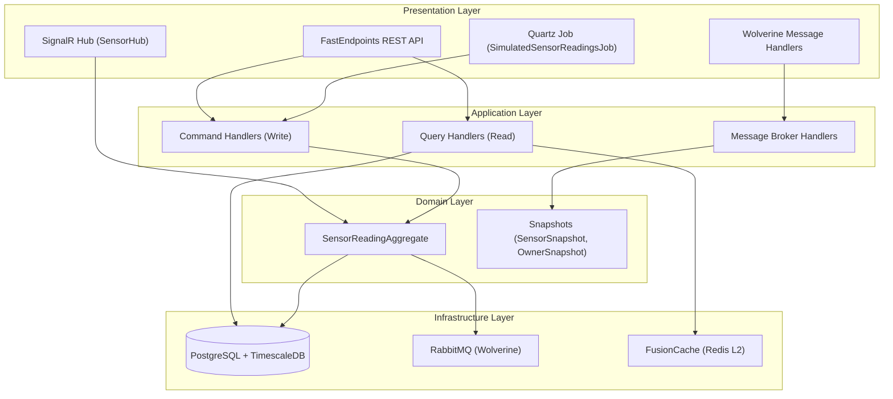

# TC.Agro Sensor Ingest Service 📡

[](https://dotnet.microsoft.com/)
[](https://docs.microsoft.com/en-us/dotnet/csharp/)
[](https://github.com/rdpresser/tc-agro-sensor-ingest-service)
[](https://github.com/rdpresser/tc-agro-sensor-ingest-service)
[](https://github.com/rdpresser/tc-agro-sensor-ingest-service)
[](LICENSE)

> **Sensor Ingestion Microservice** — time-series persistence, dashboard reads, real-time SignalR updates, and automated sensor simulation with real weather data.

---

## 📋 Table of Contents

- [Overview](#-overview)
- [Architecture](#-architecture)
- [Technologies](#-technologies)
- [Prerequisites](#-prerequisites)
- [Quick Start](#-quick-start)
- [Configuration](#-configuration)
- [Running](#-running)
- [API Endpoints](#-api-endpoints)
- [Sensor Simulation](#-sensor-simulation)
- [Real-Time Updates (SignalR)](#-real-time-updates-signalr)
- [Messaging](#-messaging)
- [Metrics & Observability](#-metrics--observability)
- [Testing](#-testing)
- [Project Structure](#-project-structure)
- [Domain-Driven Design](#-domain-driven-design)
- [License](#-license)

---

## 🎯 Overview

**TC.Agro Sensor Ingest Service** handles everything related to sensor readings: ingesting, persisting, querying, and broadcasting in real-time. It:

- ✅ **Receives sensor readings** via REST API (single and batch)
- ✅ **Validates data** with domain rules enforced in `SensorReadingAggregate`
- ✅ **Persists time-series data** to PostgreSQL with TimescaleDB-optimized indexes
- ✅ **Serves dashboard queries** — latest readings and historical data
- ✅ **Caches hot queries** with FusionCache (L1 in-memory + L2 Redis)
- ✅ **Publishes integration events** via Wolverine Outbox Pattern to RabbitMQ
- ✅ **Pushes real-time updates** via SignalR to connected dashboard clients
- ✅ **Simulates sensor data** automatically via Quartz job + Open-Meteo real weather API
- ✅ **Maintains snapshots** of sensors and owners for query enrichment without cross-service calls

### Processing Flow



---

## 🏗️ Architecture

Hexagonal Architecture (Ports & Adapters) with DDD and CQRS:



**Patterns:** Hexagonal Architecture · DDD · CQRS · Outbox Pattern · Snapshot Pattern · Multi-level Caching · Result Pattern

---

## 🛠️ Technologies

| Category | Technology |
|---|---|
| Runtime | .NET 10 / C# 14 |
| API | FastEndpoints 7.2 |
| Real-time | SignalR |
| ORM | Entity Framework Core 10 |
| Database | PostgreSQL 16 + TimescaleDB indexes |
| Cache | FusionCache 2.0 + Redis 7 |
| Messaging | WolverineFx 5.15 + RabbitMQ 4 |
| Scheduling | Quartz.NET 4 |
| Weather API | Open-Meteo (free, no API key required) |
| Simulation | Bogus (fallback data generation) |
| Observability | OpenTelemetry · Serilog · Prometheus |
| Validation | FluentValidation 12 · Ardalis.Result |
| Testing | xUnit v3 · FakeItEasy · Shouldly |

---

## 📦 Prerequisites

```bash
dotnet --version   # 10.0.x
docker --version   # 24.0.x or higher
```

**Shared packages** (from `tc-agro-common`): `TC.Agro.Contracts`, `TC.Agro.Messaging`, `TC.Agro.SharedKernel`

---

## 🚀 Quick Start

```bash
git clone https://github.com/rdpresser/tc-agro-sensor-ingest-service.git
cd tc-agro-sensor-ingest-service

# Start infrastructure (PostgreSQL, Redis, RabbitMQ)
docker compose up -d

# Apply migrations
dotnet ef database update \
  --project src/Adapters/Outbound/TC.Agro.SensorIngest.Infrastructure \
  --startup-project src/Adapters/Inbound/TC.Agro.SensorIngest.Service

# Run the service
dotnet run --project src/Adapters/Inbound/TC.Agro.SensorIngest.Service
```

**Verify:**
```bash
curl http://localhost:5003/health/ready
# open http://localhost:5003/swagger
```

---

## ⚙️ Configuration

```json
// appsettings.Development.json (key fields)
{
  "ConnectionStrings": {
    "DefaultConnection": "Host=localhost;Port=5432;Database=agro_sensor_ingest;Username=postgres;Password=postgres",
    "Redis": "localhost:6379,abortConnect=false"
  },
  "RabbitMQ": {
    "Host": "localhost",
    "Port": 5672,
    "Username": "guest",
    "Password": "guest"
  },
  "SensorReadingsJob": {
    "IntervalSeconds": 30,
    "Enabled": true
  },
  "WeatherProvider": {
    "Latitude": -23.55,
    "Longitude": -46.63,
    "Enabled": true
  }
}
```

**Environment variables (Docker/Kubernetes):**
```bash
export ConnectionStrings__DefaultConnection="Host=postgres;..."
export ConnectionStrings__Redis="redis:6379"
export RabbitMQ__Host=rabbitmq
export SensorReadingsJob__IntervalSeconds=60
export WeatherProvider__Latitude=-23.55
export WeatherProvider__Longitude=-46.63
```

---

## 🏃 Running

```bash
# With hot reload
dotnet watch run --project src/Adapters/Inbound/TC.Agro.SensorIngest.Service
```

**Available:**

| URL | Purpose |
|---|---|
| `http://localhost:5003/swagger` | API documentation |
| `http://localhost:5003/health/live` | Liveness probe |
| `http://localhost:5003/health/ready` | Readiness probe (PostgreSQL + Redis) |
| `http://localhost:5003/metrics` | Prometheus metrics |
| `ws://localhost:5003/dashboard/sensorshub` | SignalR Hub |

---

## 🔌 API Endpoints

All endpoints require **JWT Bearer Token**.

### Ingestion

| Method | Path | Roles | Description |
|---|---|---|---|
| `POST` | `/readings` | Admin, Producer, Sensor | Ingest single reading → `202 Accepted` |
| `POST` | `/readings/batch` | Admin, Producer, Sensor | Ingest batch of readings → `202 Accepted` |

**Single reading request body:**
```json
{
  "sensorId": "3fa85f64-5717-4562-b3fc-2c963f66afa6",
  "timestamp": "2026-02-27T10:30:00Z",
  "temperature": 28.5,
  "humidity": 65.2,
  "soilMoisture": 42.1,
  "rainfall": 0.0,
  "batteryLevel": 85.0
}
```

**On success, the service:**
1. Validates input via `SensorReadingAggregate` (domain rules + sensor existence check)
2. Persists to `sensor_readings` table (indexed for TimescaleDB-style queries)
3. Invalidates FusionCache entries for the affected sensor
4. Enqueues `SensorIngestedIntegrationEvent` via Wolverine Outbox
5. Pushes live update to `SensorHub` (SignalR)

### Dashboard Reads

| Method | Path | Roles | Description |
|---|---|---|---|
| `GET` | `/dashboard/latest` | Admin, Producer | Latest readings, paginated, cached (60s TTL) |
| `GET` | `/sensors/{id}/readings/history` | Admin, Producer | Historical readings for a sensor (up to 30 days) |

**`GET /dashboard/latest` query params:** `pageNumber`, `pageSize`, `sensorId` (optional), `plotId` (optional)

**`GET /sensors/{id}/readings/history` query params:** `days` (1–30, default 7), `pageNumber`, `pageSize`

---

## ⏰ Sensor Simulation

A **Quartz job** (`SimulatedSensorReadingsJob`) runs on a configurable interval and generates readings for all active sensors automatically — no physical hardware needed during development and evaluation.

### Flow

```
Quartz trigger (every N seconds, configurable via SensorReadingsJob:IntervalSeconds)
  1. Load all active SensorSnapshots
  2. Call Open-Meteo API (temperature, humidity, soil moisture, precipitation)
       → cache result for 60 minutes (same weather cycle shared across all sensors)
       → on API failure: fall back to Bogus-generated data within realistic ranges
  3. Per sensor: apply ±2% variance to weather values to simulate individual readings
  4. SensorReadingAggregate.Create(...)  ← domain validation
  5. Persist to sensor_readings table
  6. Publish SensorIngestedIntegrationEvent → RabbitMQ
  7. Push to SensorHub (SignalR) → connected dashboard clients
```

### Open-Meteo integration

- **API:** [open-meteo.com](https://open-meteo.com/) — free, no API key required
- **Fields:** `temperature_2m`, `relative_humidity_2m`, `soil_moisture_0_to_1cm`, `precipitation`
- **Cache TTL:** 60 minutes
- **Fallback:** Bogus random data in realistic agricultural ranges when API is unavailable
- **Coordinates:** configurable via `WeatherProvider.Latitude` / `WeatherProvider.Longitude`

---

## 📡 Real-Time Updates (SignalR)

**Hub endpoint:** `ws://localhost:5003/dashboard/sensorshub`  
**Auth:** JWT Bearer Token (query string `access_token` or Authorization header)

```javascript
const connection = new signalR.HubConnectionBuilder()
    .withUrl("http://localhost:5003/dashboard/sensorshub", {
        accessTokenFactory: () => localStorage.getItem("jwtToken")
    })
    .withAutomaticReconnect()
    .build();

connection.on("ReceiveSensorReading", (reading) => {
    // { sensorId, temperature, humidity, soilMoisture, time }
    updateDashboard(reading);
});

connection.on("ReceiveSensorStatusChanged", (update) => {
    // { sensorId, status, changedAt }
    updateSensorBadge(update);
});

await connection.start();
```

**Events pushed to connected clients:**

| Event | Trigger | Payload |
|---|---|---|
| `ReceiveSensorReading` | Reading ingested (API or Quartz job) | `sensorId, temperature, humidity, soilMoisture, time` |
| `ReceiveSensorStatusChanged` | Sensor operational status changed | `sensorId, status, changedAt` |

---

## 📨 Messaging

### Published

| Event | Trigger | Consumer |
|---|---|---|
| `SensorIngestedIntegrationEvent` | Reading created (API or Quartz job) | Analytics Service |

### Consumed

| Event | Source | Action |
|---|---|---|
| `UserCreatedIntegrationEvent` | Identity Service | Create `OwnerSnapshot` |
| `UserUpdatedIntegrationEvent` | Identity Service | Update `OwnerSnapshot` |
| `UserDeactivatedIntegrationEvent` | Identity Service | Deactivate `OwnerSnapshot` |
| `SensorRegisteredIntegrationEvent` | Farm Service | Create `SensorSnapshot` |
| `SensorOperationalStatusChangedIntegrationEvent` | Farm Service | Update `SensorSnapshot.Status` |
| `SensorDeactivatedIntegrationEvent` | Farm Service | Deactivate `SensorSnapshot` |

---

## 📊 Metrics & Observability

- **`/metrics`** — Prometheus exposition format (HTTP, DB, FusionCache L1/L2 hit rate, Wolverine, custom ingestion counters)
- **`/health/live`** — liveness probe
- **`/health/ready`** — readiness probe (PostgreSQL + Redis)

**Distributed tracing:** W3C Trace Context + `X-Correlation-Id` header propagated through all HTTP requests and RabbitMQ messages. Exportable via OTLP to Grafana Tempo.

**Custom metrics:** ingestion rate, cache hit/miss ratio, Quartz job execution count, Open-Meteo fetch success/fallback rate.

**Local access:** Grafana `http://localhost:3000` · Prometheus `http://localhost:9090`

---

## 🧪 Testing

```bash
dotnet test
dotnet test --filter "FullyQualifiedName~Domain"
dotnet test --filter "FullyQualifiedName~Application"
dotnet test --filter "FullyQualifiedName~Service"
dotnet test --collect:"XPlat Code Coverage"
```

**Test structure:**
```
test/TC.Agro.SensorIngest.Tests/
├── Domain/
│   ├── Aggregates/     # SensorReadingAggregateTests — all validation rules
│   └── Snapshots/      # SensorSnapshot, OwnerSnapshot
├── Application/
│   ├── Handlers/       # CreateReading, CreateBatchReadings, GetLatestReadings, GetReadingsHistory
│   ├── Validators/     # CreateReadingCommand, CreateBatchReadingsCommand
│   └── Mappers/        # CreateReadingMapper
└── Service/
    ├── Endpoints/      # CreateReading, GetDashboardLatest
    └── Jobs/           # SimulatedSensorReadingsJob (GenerateReading method)
```

---

## 📂 Project Structure

```
tc-agro-sensor-ingest-service/
├── src/
│   ├── Core/
│   │   ├── TC.Agro.SensorIngest.Domain/
│   │   │   ├── Aggregates/
│   │   │   │   └── SensorReadingAggregate.cs       # validation rules + domain events
│   │   │   └── Snapshots/
│   │   │       ├── SensorSnapshot.cs               # denormalized sensor data (from Farm)
│   │   │       └── OwnerSnapshot.cs                # denormalized owner data (from Identity)
│   │   │
│   │   └── TC.Agro.SensorIngest.Application/
│   │       ├── MessageBrokerHandlers/
│   │       │   ├── SensorSnapshotHandler.cs        # syncs SensorSnapshot
│   │       │   └── OwnerSnapshotHandler.cs         # syncs OwnerSnapshot
│   │       ├── UseCases/
│   │       │   ├── CreateReading/
│   │       │   ├── CreateBatchReadings/
│   │       │   ├── GetLatestReadings/
│   │       │   └── GetReadingsHistory/
│   │       └── Abstractions/Ports/
│   │           ├── ISensorReadingRepository.cs
│   │           ├── ISensorReadingReadStore.cs
│   │           ├── ISensorSnapshotStore.cs
│   │           ├── ISensorHubNotifier.cs
│   │           └── IWeatherDataProvider.cs
│   │
│   └── Adapters/
│       ├── Inbound/TC.Agro.SensorIngest.Service/
│       │   ├── Endpoints/
│       │   │   ├── Readings/
│       │   │   │   ├── CreateReadingEndpoint.cs
│       │   │   │   ├── CreateBatchReadingsEndpoint.cs
│       │   │   │   └── GetLatestReadingsEndpoint.cs
│       │   │   ├── Dashboard/
│       │   │   │   └── GetDashboardLatestEndpoint.cs
│       │   │   └── Sensors/
│       │   │       └── GetReadingsHistoryEndpoint.cs
│       │   ├── Hubs/
│       │   │   └── SensorHub.cs                    # SignalR hub
│       │   ├── Jobs/
│       │   │   └── SimulatedSensorReadingsJob.cs   # Quartz job
│       │   ├── Providers/
│       │   │   └── OpenMeteoWeatherProvider.cs     # real weather data
│       │   └── Program.cs
│       │
│       └── Outbound/TC.Agro.SensorIngest.Infrastructure/
│           ├── ApplicationDbContext.cs
│           ├── Configurations/
│           │   ├── SensorReadingAggregateConfiguration.cs
│           │   ├── SensorSnapshotConfiguration.cs
│           │   └── OwnerSnapshotConfiguration.cs
│           ├── Repositories/
│           └── Migrations/
│
└── test/TC.Agro.SensorIngest.Tests/
```

---

## 🎨 Domain-Driven Design

### SensorReadingAggregate

The aggregate enforces all validation before any reading is persisted:

```csharp
var result = SensorReadingAggregate.Create(
    sensorId: sensorGuid,
    time: DateTime.UtcNow,
    temperature: 28.5,
    humidity: 65.2,
    soilMoisture: 42.1,
    rainfall: 0.0,
    batteryLevel: 85.0);

if (result.IsSuccess)
{
    await repository.AddAsync(result.Value, ct);
    // SensorReadingCreatedDomainEvent → SensorIngestedIntegrationEvent → RabbitMQ
}
```

**Validation rules:**

| Field | Rule |
|---|---|
| `SensorId` | Required; sensor must exist in `SensorSnapshot` |
| `Time` | Required; cannot be more than 5 min in the future |
| `Temperature` | Optional; -50°C to 70°C |
| `Humidity` | Optional; 0–100% |
| `SoilMoisture` | Optional; 0–100% |
| `Rainfall` | Optional; ≥ 0 |
| `BatteryLevel` | Optional; 0–100% |
| At least one metric | Temperature, humidity, soilMoisture, or rainfall must be present |

### Snapshots (denormalization)

`SensorSnapshot` and `OwnerSnapshot` are maintained by consuming events from Farm Service and Identity Service respectively. They allow query responses to be enriched (plot name, property name, owner) without synchronous cross-service calls.

---

## 📄 License

MIT License — see [LICENSE](LICENSE) for details.

> Part of TC Agro Solutions — Hackathon 8NETT · FIAP Postgraduate · Phase 5
